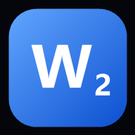

# Word C2

**Entrenador offline de Word Formation para el examen Cambridge C2 Proficiency
(CPE) y C1 Advanced.**

Una app instalable en el iPhone desde Safari, sin tiendas, sin cuentas y sin
conexión. Contiene 65 textos originales en formato Part 3 y 991 ejercicios
rápidos sobre 1.175 derivaciones distintas, construidos alrededor de las setenta
familias de afijos que decide el examen, con un algoritmo de repetición
espaciada que insiste en lo que fallás hasta que deja de fallarse.

<p align="center">
  
</p>

---

## Qué hay dentro

| | |
|---|---|
| **65 textos** | Word Formation completo, 8 huecos cada uno, formato Cambridge Part 3 |
| **520 huecos de examen** | Cada uno con su raíz, su afijo identificado y explicación en español |
| **991 ejercicios rápidos** | Una frase, una raíz, un hueco: repeticiones cortas guiadas por el algoritmo |
| **1.175 derivaciones** | Sobre 862 raíces distintas, de C1 Advanced a C2 Proficiency |
| **98 familias de afijos** | Todo el sistema morfológico del examen, con cobertura en vivo |
| **0 KB de red** | Todo se precachea en la instalación y funciona en modo avión |

Los textos no son ejercicios reciclados: están escritos de cero alrededor de las
derivaciones de la lista de origen, de modo que cada palabra aparece en un
contexto nuevo cada vez que vuelve.

## La idea

El vocabulario del inglés es abierto: siempre hay una palabra más. Su
**morfología** no lo es. El Part 3 se resuelve con unos setenta afijos, y quien
domina esos setenta puede derivar una palabra que no vio nunca.

Por eso la app no está organizada por palabras sino por familias. Cuando fallás
once ejercicios, la pantalla de Puntos débiles no te muestra once palabras
sueltas: te muestra que diez de ellas eran `-ANCE` contra `-ENCE`. Eso es un
diagnóstico, y se arregla con una sesión de esa familia.

## La garantía de cobertura

`docs/word-list.md` contiene las 598 derivaciones que motivaron el proyecto.
No es documentación decorativa: `tests/coverage.test.mjs` la lee y **falla el
build** si alguna no está cubierta por al menos un ejercicio.

```
Learner list: 598 / 598 covered
Every derivation on the list is covered.
```

`npm run report` lo imprime en cualquier momento.

## Instalación en el iPhone

La app se publica en GitHub Pages y se instala desde Safari. Es gratis y no
requiere cuenta de desarrollador.

1. **Publicá el repositorio** (ver la sección siguiente).
2. En **Settings → Pages** del repo, elegí `Deploy from a branch` → rama `main` →
   carpeta `/ (root)`. GitHub te da una URL del tipo
   `https://TU-USUARIO.github.io/word-c2/`.
3. Abrí esa URL **en Safari** (no en Chrome: iOS sólo permite instalar desde
   Safari).
4. Tocá el botón **Compartir** (el cuadrado con la flecha) → **Añadir a pantalla
   de inicio**.
5. Abrí la app desde el ícono nuevo. Ya no es una pestaña: no tiene barra de
   direcciones, ocupa toda la pantalla y arranca instantánea.
6. Para comprobarlo: activá el **modo avión** y abrila. Funciona igual.

> El progreso se guarda en el dispositivo y la app funciona sin conexión. Si
> querés el mismo avance en el celular y en la notebook, activá la
> sincronización: Ajustes → Sincronización → *Activar*. Es un código de 16
> caracteres, sin cuentas ni contraseñas — los detalles están en
> [docs/sync.md](docs/sync.md).

## Publicar el repositorio

Todo el historial ya está construido localmente. Sólo falta enviarlo, y se envía
entero de una sola vez:

1. Creá un repositorio **vacío** en <https://github.com/new> (sin README, sin
   `.gitignore`, sin licencia). Llamalo `word-c2`.
2. Desde la carpeta del proyecto, ejecutá una línea:

   ```powershell
   .\scripts\publish.ps1 -RemoteUrl https://github.com/TU-USUARIO/word-c2.git
   ```

   El script configura el remoto y hace un único `git push` que sube todos los
   commits juntos. La primera vez, Git abre una ventana del navegador para que
   inicies sesión en GitHub.

Si preferís bash (Git Bash, WSL, macOS):

```bash
./scripts/publish.sh https://github.com/TU-USUARIO/word-c2.git
```

## Cómo estudia la app

El motor no lleva la cuenta de las palabras: lleva la cuenta de las
**derivaciones**. `ACCESS → ACCESSIBLE` y `ACCESS → INACCESSIBLE` son dos
habilidades distintas y se programan por separado.

- Cada derivación vive en una **caja de Leitner** del 0 al 5.
- Acertar sube una caja; fallar baja **dos**.
- Los intervalos son 0, 1, 2, 4, 9 y 21 días.
- Un fallo vuelve además dentro de la **misma sesión**, tres tarjetas después.
- Se considera dominada a partir de la caja 4.

El indicador de *Grade A* no es `dominadas / total`, que se quedaría en 0%
durante quince días. Es un compuesto de cobertura (45%), solidez en las cajas
(40%) y precisión (15%), de modo que la aguja se mueve desde la primera sesión
pero sólo llega a 90 cuando el banco está de verdad cubierto.

La consecuencia práctica: si fallás `INSURMOUNTABLE`, va a reaparecer esta tarde
en un ejercicio rápido, mañana en otra frase y la semana que viene dentro de un
texto de examen distinto.

## Desarrollo

No hay build, ni bundler, ni dependencias en tiempo de ejecución. Se sirve tal
cual.

```bash
npm install          # sólo para el smoke test con jsdom
npm run serve        # http://localhost:8080
npm test             # 62 pruebas: contenido, morfología, algoritmo e interfaz
npm run test:unit    # las 52 que no necesitan jsdom
npm run lint:syntax  # parsea los 53 archivos que precachea el service worker
npm run report       # tamaño del banco y cobertura contra la lista de origen
npm run icons        # regenera el set de iconos PNG
```

El service worker no se registra sobre `file://`, así que para probar el
funcionamiento offline hay que usar `npm run serve`.

## Documentación

| Documento | Contenido |
|---|---|
| [docs/architecture.md](docs/architecture.md) | Estructura, arranque y por qué no hay framework |
| [docs/affix-system.md](docs/affix-system.md) | El motor de morfología: las ocho familias y el analizador |
| [docs/srs-algorithm.md](docs/srs-algorithm.md) | El programador de repaso en detalle |
| [docs/content-model.md](docs/content-model.md) | Formato de textos y ejercicios, y las doce reglas que se verifican |
| [docs/word-list.md](docs/word-list.md) | La lista de origen: 598 derivaciones, contrato de cobertura |
| [docs/design-system.md](docs/design-system.md) | Tokens, el par hueco + raíz, escala tipográfica y motion |
| [docs/sync.md](docs/sync.md) | Sincronización entre dispositivos: puesta en marcha, reglas de fusión y seguridad |
| [docs/ios-installation.md](docs/ios-installation.md) | Instalación en iPhone y sus límites |
| [docs/deployment.md](docs/deployment.md) | GitHub Pages y publicación |
| [docs/accessibility.md](docs/accessibility.md) | Contraste, tamaños táctiles, motion reducido |
| [docs/performance.md](docs/performance.md) | Presupuesto de carga y estrategia de caché |
| [docs/roadmap.md](docs/roadmap.md) | Qué falta |

## Licencia

MIT. Ver [LICENSE](LICENSE).
